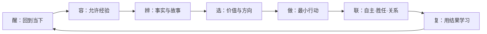

# 七环整合成长法：总方法论

[[00-项目导航|返回项目导航]]

## 方法论名称

本教程将不同心理学传统中可互补的部分，重新组织为：

> **七环整合成长法：一心、两翼、三层、四尺、七环、五标。**

它不是某位心理学家原封不动提出的理论，而是为生活实践和亲子心理教育所做的原创整合框架。每一个组成部分都应接受现实结果检验。

## 一心：可选择的当下

方法的中心不是“保持开心”，而是**恢复选择**。

可选择的当下，指一个人即使有恐惧、愤怒、羞耻、杂念或拖延冲动，仍能：

- 知道自己正在经历什么；
- 区分事实与脑内故事；
- 记得什么对自己重要；
- 做出一个不完全受旧模式支配的小动作。

这与正念的当下觉察、ACT的心理灵活性、CBT的认知辨识、弗兰克尔的态度选择都有连接，但不把它们说成同一理论。

## 两翼：关怀与担当

只有一只翅膀，成长很容易失衡。

### 关怀

- 看见痛苦和限制；
- 不用羞辱迫使自己改变；
- 允许休息、求助、调整难度；
- 区分“一个行为需要修正”和“整个人没有价值”。

### 担当

- 承认行为的现实影响；
- 设立安全和关系边界；
- 在能力范围内修复；
- 把重要价值变成行动，而非只停在理解。

关怀没有担当，会变成回避；担当没有关怀，会变成自我压迫。成熟的句式是：

> “我理解这个反应为何出现，同时我对接下来怎样做负有责任。”

## 三层：身体、心理、关系情境

同一个问题要至少从三层观察。

| 层次 | 观察对象 | 常用工具 | 容易犯的错 |
|---|---|---|---|
| 身体／神经系统层 | 睡眠、饥饿、疼痛、感官负荷、警报强度、药物与发育因素 | 外部定向、节律运动、休息、医疗评估、环境降噪 | 把生理困难骂成意志薄弱 |
| 心理／意义层 | 情绪、解释、信念、价值、身份故事、技能 | 命名、四格辨识、认知解离、价值澄清、自我慈悲 | 只分析道理，不改变经验和行动 |
| 关系／情境层 | 家庭互动、学校或工作要求、权力、资源、边界、文化 | 共情、协商、任务适配、支持系统、清晰后果、制度改变 | 把系统问题全变成个人心态问题 |

例如孩子不写作业，不能只问“她在想什么”，还应问：是否睡眠不足？任务是否超出技能？亲子对话是否已变成权力斗争？是否存在ADHD、焦虑、学习障碍或校园压力？

## 四尺：当下、一天、一周、一季

成长需要不同时间尺度，不能用一次表现判断一个人。

### 当下尺：10—90秒

目标：从自动反应中拿回一点选择。

工具：脚踩地、看四周、命名、暂停、一个小动作。

### 一天尺：12—30分钟

目标：让价值进入日程。

工具：晨间方向、一个专注块、晚间三行复盘。

### 一周尺：30—60分钟

目标：调整任务、环境、关系支持和难度。

工具：五标复盘、家庭实验、一次修复谈话。

### 一季尺：90天

目标：形成一项可观察的长期改变，不追求人格大改造。

工具：一个核心价值、一个关键能力、一个环境系统、一个支持关系、复发预案。

## 七环：醒—容—辨—选—做—联—复

七环是一个循环，不是只能按顺序走的楼梯。

### 醒：我现在在哪里？

主要来源：詹姆斯的注意与习惯、现代正念、创伤知情定向。

关键句：**“发现走神，不是失败；那就是醒来的瞬间。”**

### 容：我能否不把自己变成敌人？

主要来源：罗杰斯的接纳、内夫的自我慈悲、ACT的开放态度。

关键句：**“它可以在场，但不必当总指挥。”**

### 辨：摄像机看见了什么？大脑又添加了什么？

主要来源：贝克与埃利斯的认知传统、ACT认知解离、荣格对情结和投射的观察。

关键句：**“这是一个想法，不是自动生效的事实。”**

### 选：此刻我想代表什么？

主要来源：弗兰克尔的意义、ACT价值、阿德勒的共同体感、荣格的个体化。

关键句：**“不等情绪批准，我先选择方向。”**

### 做：下一步能否小到现在开始？

主要来源：班杜拉的自我效能、行为科学、实施意图、习惯研究。

关键句：**“不证明整个人生，只完成下一步。”**

### 联：怎样让自主、胜任和关系共同存在？

主要来源：德西与瑞安的自我决定理论、罗杰斯、依恋与家庭干预传统。

关键句：**“我们不是彼此的问题，我们一起面对问题。”**

### 复：结果教会了我什么？

主要来源：经验学习、CBT行为实验、成长性学习、科学方法。

关键句：**“复盘不是审判，是更新设计。”**

## 五标：怎样知道真的在成长

不以“永不难过”“永不拖延”“孩子完全听话”为成功。每周追踪五个更可靠的过程指标：

| 指标 | 定义 | 可观察例子 |
|---|---|---|
| 觉察提前量 | 比过去更早发现自动反应 | 过去吵完才知道生气，现在声音升高时就发现 |
| 恢复速度 | 从触发到能思考、沟通或行动的时间 | 从半天缩短到40分钟 |
| 价值行动率 | 困难在场时仍完成重要小步的频率 | 一周5天做了10分钟起步 |
| 联结修复力 | 求助、倾听、设边界与修复的能力 | 冲突后能约时间重谈并承认自己的部分 |
| 生命活力度 | 好奇、创造、玩耍、贡献和真实投入 | 本周有两次忘记比较、投入创作的时刻 |

不把五项合成“总人格分”。它们的功能是发现趋势和调整支持。

## 三种使用模式

### 日常成长模式

适用于普通压力、拖延、关系摩擦。使用完整七环或90秒版本。

### 高警报模式

当强度达到7/10以上：只做“醒—容—联”，即定向、降低刺激、找安全支持。暂不辩论认知、意义或责任；等恢复后再复盘。

### 专业协作模式

当问题持续、严重或涉及诊断风险时，七环只用于记录和沟通：带着睡眠、触发、行为、功能和已尝试支持的资料，与医生、治疗师、学校共同制定方案。

## 教学原则：故事先于结论，示范先于要求

给孩子使用时遵循六条：

1. 家长先练，不把方法变成控制孩子的新工具。
2. 先共同调节，再解决问题。
3. 用角色的选择展示，不让角色长篇讲课。
4. 允许孩子不同意、跳过或发明自己的方法。
5. 练习放在真实低风险场景，不等危机时第一次使用。
6. 讨论行为影响，不以心理概念给孩子贴标签。

## 一句话总纲

> **看见发生了什么，善待正在经历的人，辨清事实与故事，选择值得的方向，把方向缩成一步，在关系与环境中行动，再让真实结果更新下一次选择。**

